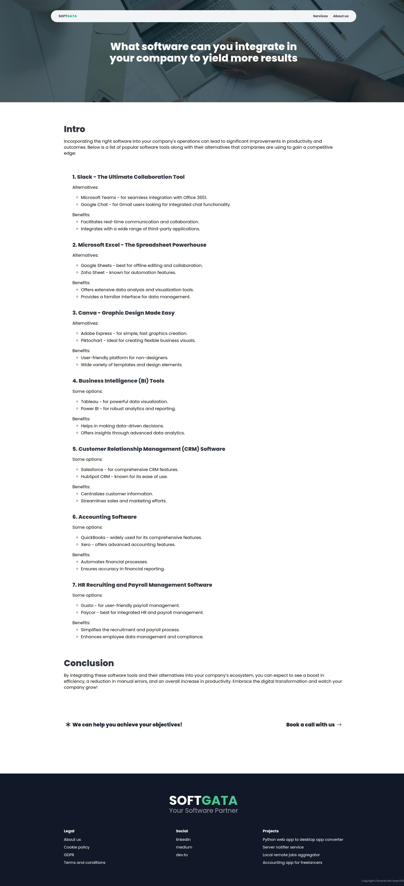

# A React (Remix), Typescript, Drizzle ORM project

This is one of the older versions of softgata.com (my site) which I've build in React (Typescript) using RemixJs framework (now React Router v7). It has multiple pages, some small animations and a contact form which saves data using Drizzle ORM.

The design is done in Figma.
The styling is done as a combination of BulmaCSS and TailwindCSS.

You can take a quick look here: 

Landing page:


Blog page:



# React/Remix QuickStart

📖 See the [Remix docs](https://remix.run/docs) and the [Remix Vite docs](https://remix.run/docs/en/main/future/vite) for details on supported features.

## Development

Run the Vite dev server:

```shellscript
npm run dev
```

## SQLITE

https://orm.drizzle.team/docs/get-started-sqlite#better-sqlite3


## Deployment

First, build your app for production:

```sh
npm run build
```

Then run the app in production mode:

```sh
npm start
```

Now you'll need to pick a host to deploy it to.

### DIY

If you're familiar with deploying Node applications, the built-in Remix app server is production-ready.

Make sure to deploy the output of `npm run build`

- `build/server`
- `build/client`
